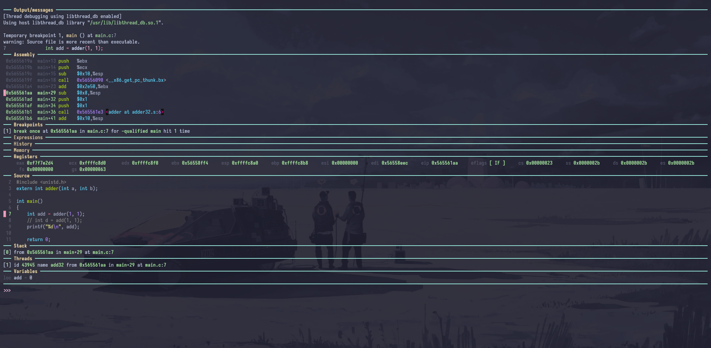

这个项目是一个伪GDB项目，因为我看trace是真看不出来东西，动态调试我感觉会更好用些，所以我选择实现一个假装自己在调试的功能
差不多图片里面的内容就是实现出来的目标，肯定会少一些功能，因为我这个不是调试器，仅仅属于文本解析器



一个基于终端的交互式指令跟踪可视化工具，用于调试和分析汇编程序执行过程。

## 🌟 特性

- **实时指令跟踪**：逐条显示ARM64汇编指令执行过程
- **寄存器状态监控**：高亮显示寄存器值的变化
- **交互式控制**：支持前进、后退、跳转到指定指令
- **自动步进模式**：可调节速度的自动执行
- **内存视图**：计划中的内存内容显示功能
- **多种输入方式**：支持命令行参数和交互式命令
- **跨平台**：基于Go语言，支持Windows、Linux、macOS

## 📦 安装

### 方式一：从源码构建

``` shell
# 克隆仓库
git clone https://github.com/yourusername/TraceParse.git
cd TraceParse

# 构建
go build -o traceparse main.go

# 运行
./traceparse -f your_trace_file.log
```

### 方式二：直接运行

```shel
go run main.go -f your_trace_file.log
```


### 启动程序

```shell
# 使用命令行参数加载文件
./traceparse -f trace.log

# 或使用长选项
./traceparse --file trace.log

# 如果不指定文件，程序会加载默认示例
./traceparse
```

### 3. 基本使用

程序启动后，你会看到三个主要面板：

- **左侧**：汇编指令列表，当前指令用黄色高亮
- **中间**：寄存器状态，变化的值用黄色标记
- **右侧**：状态信息和命令输入

## ⌨️ 交互命令

| 命令         | 快捷键 | 说明           |
| :----------- | :----- | :------------- |
| `n` / `next` | →      | 下一条指令     |
| `n5`         | -      | 前进5条指令    |
| `p` / `prev` | ←      | 上一条指令     |
| `p3`         | -      | 后退3条指令    |
| `g 10`       | -      | 跳转到第10行   |
| `space`      | 空格   | 重复上一个命令 |

### 控制命令

| 命令             | 说明                |
| :--------------- | :------------------ |
| `run`            | 开始自动步进        |
| `stop`           | 停止自动步进        |
| `step 500`       | 设置步进延迟为500ms |
| `load trace.log` | 加载新跟踪文件      |
| `r` / `reg`      | 刷新寄存器显示      |
| `q` / `quit`     | 退出程序            |

### 帮助

- `h` / `help` - 显示帮助信息
- 按回车不输入内容 - 重复上一个命令
